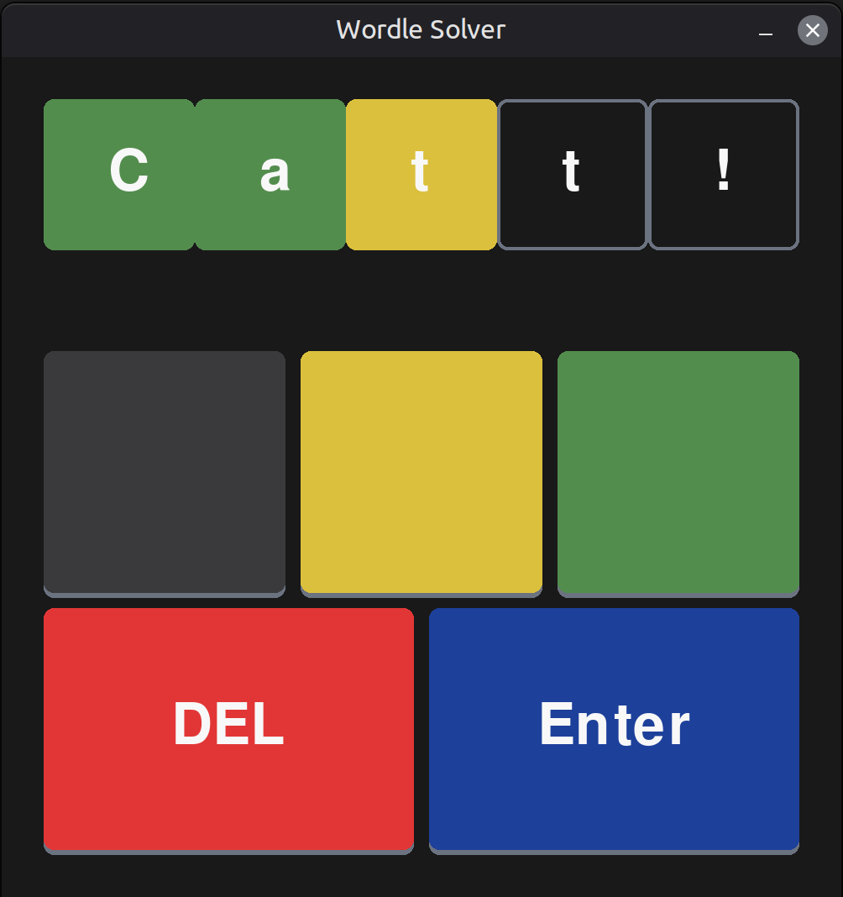

# Wordle Simulator and Solver

This repository contains a comprehensive suite of Python tools designed to simulate the game mechanism of Wordle and/or solve it using an optimized information-theoretic approach. The project includes a fully functional terminal-based game simulator, a command-line solver, and a Graphical User Interface (GUI) solver built with Pygame.

<p align="center">
  
</p>

## Table of Contents
- [Overview](#overview)
- [Algorithmic Approach](#algorithmic-approach)
- [Performance](#performance)
- [Installation and Requirements](#installation-and-requirements)
- [Usage](#usage)
  - [GUI Solver](#gui-solver)
  - [Terminal Solver](#terminal-solver)
  - [Terminal Simulator](#terminal-simulator)
- [Project Structure](#project-structure)

## Overview

The core objective of this software is to determine the mathematically optimal guess at any stage of a Wordle game. By analyzing the entire search space of valid 5-letter words, the system calculates which guess will provide the maximum amount of information (entropy) regarding the secret word, thereby minimizing the expected number of remaining guesses required to solve the puzzle.

## Algorithmic Approach

The solver logic relies on **Shannon Entropy**. For every potential guess $w$, the algorithm performs the following steps:

1.  **Pattern Simulation:** It simulates the feedback pattern (Green, Yellow, Gray) that $w$ would generate against every remaining possible solution.
2.  **Probability Distribution:** It calculates the probability distribution of these patterns.
3.  **Entropy Calculation:** It computes the entropy $H$ of the guess using the formula:
    $$H(w) = - \sum_{p \in P} p(x) \log_2 p(x)$$
    Where $p(x)$ is the probability of a specific color pattern occurring.
4.  **Score Optimization:** The final score for a word is derived from its entropy and the expected number of remaining solutions. The system prioritizes words that:
    *   Maximize information gain (high entropy).
    *   Minimize the average pool size of remaining candidates.
    *   Are present in the potential solution set (preferring valid answers over obscure dictionary words when scores are similar).

## Performance

Tested against the full set of standard Wordle solutions (2315 words).
* Average Guesses: 3.50
* Win Rate: 100%
* Most Common Result: 3 guesses
  
Guess Distribution
```
1:    1 |  (0.0%)
2:   97 | ██ (4.2%)
3: 1066 | ███████████████████████ (46.0%)
4: 1042 | ██████████████████████ (45.0%)
5:  106 | ██ (4.6%)
6:    3 |  (0.1%)
```

## Installation and Requirements

### Prerequisites
*   **Python 3.10+** (Type hinting syntax is used).
*   **pip** (Python Package Installer).

### Dependencies
The core logic and terminal tools utilize standard Python libraries. The GUI Solver requires `pygame`.

```bash
# Clone the repository
git clone https://github.com/aleCatt/Wordle_Simulator_and_Solver.git
cd Wordle_Simulator_and_Solver

# Install Pygame
pip install pygame
```

### Data Files
Ensure the following text files are present in the root directory:
*   `wordle_solutions.txt`: The official list of possible secret words.
*   `wordle_allowed_guesses.txt`: The comprehensive dictionary of allowed inputs.

## Usage

### GUI Solver
The Graphical User Interface provides the most intuitive experience for solving live games.

1.  Run the script:
    ```bash
    python pygame_wordle_solver.py
    ```
2.  The solver will suggest an initial opening word (default: `RAISE`). Enter this word into your external Wordle game.
3.  Observe the colors returned by the game.
4.  **Input the feedback:** Click the colored buttons in the GUI to replicate the pattern shown in your game.
    *   **Gray Button (or key `0`):** Letter absent.
    *   **Yellow Button (or key `1`):** Letter present, wrong position.
    *   **Green Button (or key `2`):** Letter present, correct position.
    *   *Note: Use the DEL button (or key) to correct mistakes.*
5.  Click **Enter button (or key)** to submit the pattern. The solver will process the data and render the next optimal guess.

### Terminal Solver
A lightweight, text-only interface for the solver algorithm.

1.  Run the script:
    ```bash
    python terminal_wordle_solver.py
    ```
2.  The script will print a suggested word.
3.  Enter the feedback pattern received from the game as a 5-digit string:
    *   `0`: Gray (Miss)
    *   `1`: Yellow (Misplaced)
    *   `2`: Green (Exact)
    *   *Example:* If the feedback is Green-Gray-Yellow-Gray-Gray, input `20100`.

### Terminal Simulator
A complete, playable clone of Wordle that runs in your console.

1.  Run the script:
    ```bash
    python wordle_simulator.py
    ```
2.  Type a 5-letter guess and press Enter.
3.  The terminal will display the guess with ANSI color coding:
    *   **Green:** Correct letter, correct position.
    *   **Yellow:** Correct letter, wrong position.
    *   **Purple/Gray:** Letter not in word.

## Project Structure

| File | Description |
| :--- | :--- |
| `wordle_utils.py` | Contains the core backend logic: file loading, pattern evaluation, entropy calculation, and candidate filtering. |
| `pygame_wordle_solver.py` | The Pygame-based GUI application for the solver. |
| `terminal_wordle_solver.py` | The CLI-based interface for the solver. |
| `wordle_simulator.py` | The playable terminal game script. |
| `wordle_solutions.txt` | Dataset of potential target words. |
| `wordle_allowed_guesses.txt` | Dataset of all valid dictionary entries. |

---
*Disclaimer: This project is for educational purposes and is not affiliated with the New York Times or the official Wordle game.*
